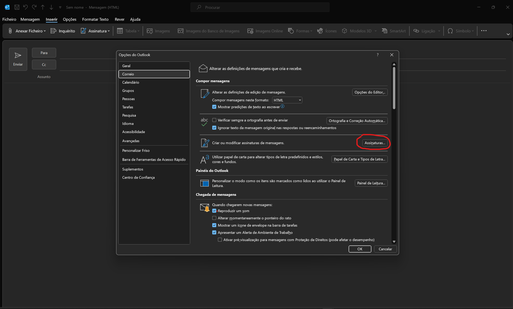

## Assinaturas

Guia de como alterar a assinatura de email sem a desformatar:

### 1º Passo: ###

- Fazer download do zip deste repositório
- Extrair os conteúdos do zip
- Abrir a pasta com a assinatura desejada

### 2º Passo: ###

- Abrir o Outlook
- Clicar em "Novo E-mail"
- Ir a Inserir -> Assinatura -> Assinaturas..

### 3º Passo: ###

- Clicar em "Novo"
- Colocar o nome "Norasil Natal" ou "Norasil" dependendo da assinatura pretendida
- Escolher como assinatura predefinida em `Novas mensagens` e `Respostas/reencaminhamentos`
- Selecionar "OK"

### 4º Passo: ###

- Selecionar "Ficheiro"
- Selecionar "Opções"
- Clicar em "Assinaturas" pressionando o "CTRL"

### 5º Passo: ###
- Abrirá uma pasta com vários ficheiros. Haverá algum com o nome igual ao do ficheiro que está na pasta descarregada anteriormente. 
- Substituir ficheiro com o da pasta descarregada
- _Caso exista varios ficheiros com o mesmo nome, clique em `Ver -> mostrar -> Extensões de nome de ficheiro` e substitua o que termina em ``.htm``_ 

Após concluidos todos estes passos, a nova assinatura encontra-se operacional.
